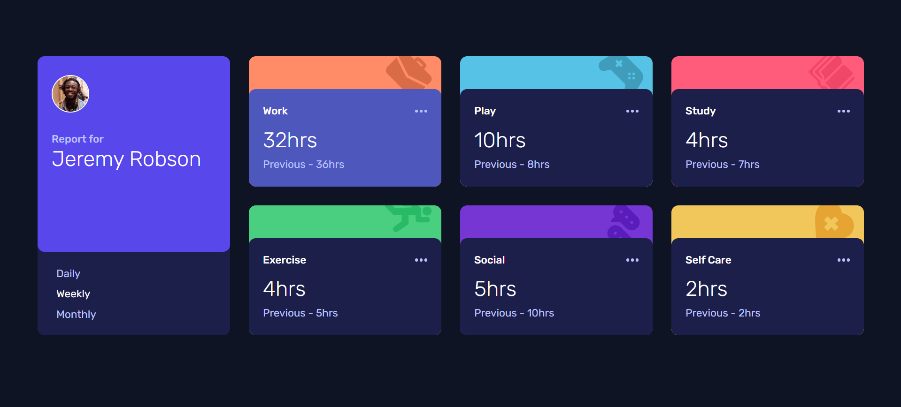

# Frontend Mentor - Time tracking dashboard solution

This is a solution to the [Time tracking dashboard challenge on Frontend Mentor](https://www.frontendmentor.io/challenges/time-tracking-dashboard-UIQ7167Jw).

## Table of contents

- [Overview](#overview)
  - [The challenge](#the-challenge)
  - [Screenshot](#screenshot)
  - [Links](#links)
- [My process](#my-process)
  - [Built with](#built-with)
  - [What I learned](#what-i-learned)
  - [Continued development](#continued-development)
- [Author](#author)
- [Acknowledgments](#acknowledgments)

## Overview

### The challenge

Users should be able to:

- View the optimal layout for the site depending on their device's screen size
- See hover states for all interactive elements on the page
- Switch between viewing Daily, Weekly, and Monthly stats

### Screenshot

### Links

- Solution URL: [Solution](https://www.frontendmentor.io/solutions/time-tracking-dashboard-tailwind-vanilla-js-OxlwH0tfET)
- Live Site URL: [Site](https://mohammed-nedjima.github.io/Time-tracking-dashboard/)

## My process

### Built with

- Semantic HTML5 markup
- [Tailwindcss](https://tailwindcss.com/)
- CSS Grid
- Mobile-first workflow
- Vanilla JavaScript

### What I learned

- I learned how to use the fetch api to use data from a json file
- I also learned how to use JavaScript to puplate the DOM and change content on the page
- In addition to imporving my skills in using css grid and how to place items using grid-start and grid-end

### Continued development

- This is my first project using tailwind and I find it very useful. I want to continue imporoving this skill.
- I want also to perfect using css grid and using the fetch api

## Author

- Frontend Mentor - [@Mohammed-Nedjima](https://www.frontendmentor.io/profile/Mohammed-Nedjima)
- Linkedin - [@Nedjima_Mohammed_Ayoub](https://www.linkedin.com/in/mohammed-ayoub-nedjima/)

## Acknowledgments

Thanks to front-end mentor team for providing such amazing challenge. It helped me a lot in improving my skills in JavaScript and gave a push to the next level.
